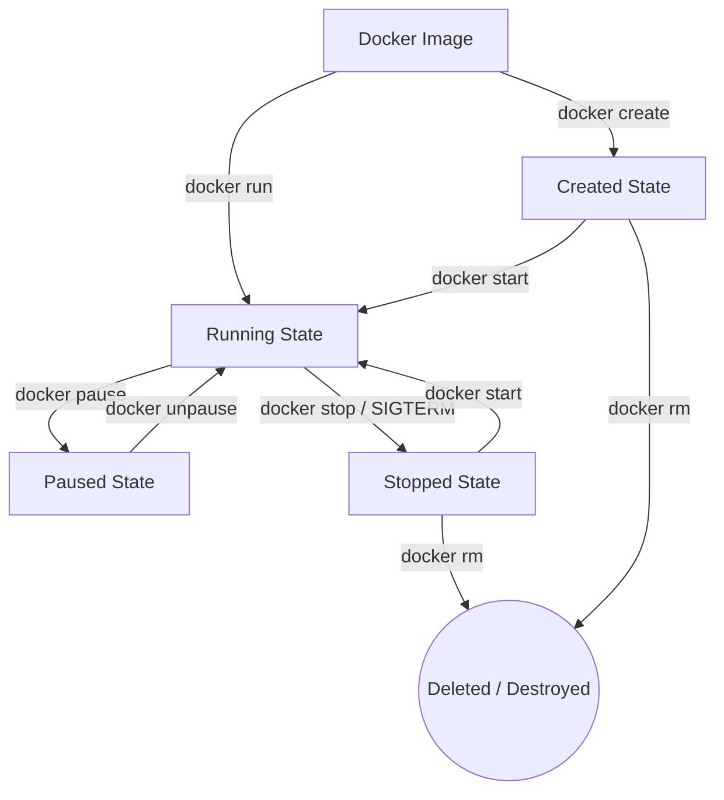

# Week 1 - Day 2: Container Lifecycle & CLI Playground 🐳

Today, I deep dived into the **Docker Container Lifecycle** and practiced managing state transitions on a real **Ubuntu 24.04 LTS** container.

---

## 📌 Concepts: The Container Lifecycle

A container goes through various states during its existence. Understanding these states is crucial for container orchestration and troubleshooting:



### 1. `Created` (Isolated layer setup)
*   **Command:** `docker create <image-name>`
*   **What happens:** Docker sets up the isolated namespaces, cgroups, and read-write container layer, but **does not start the main process (PID 1)**. It consumes zero CPU.

### 2. `Running` (Active execution)
*   **Command:** `docker run` or `docker start`
*   **What happens:** The container is booted, and its primary process (PID 1) begins executing. It consumes CPU, memory, and network resources.

### 3. `Paused` (CPU frozen, memory cached)
*   **Command:** `docker pause`
*   **What happens:** Using Linux `cgroups freezer`, the execution of all processes inside the container is suspended. The container memory state is frozen in RAM, but CPU scheduling is halted.

### 4. `Stopped` (Graceful shutdown)
*   **Command:** `docker stop`
*   **What happens:** Docker sends `SIGTERM` to the container's PID 1, waits (by default 10 seconds), and sends `SIGKILL` if it hasn't exited. The main process terminates. The filesystem state remains preserved on disk.

### 5. `Deleted` (Permanently removed)
*   **Command:** `docker rm`
*   **What happens:** The container's read-write filesystem layer and configuration details are completely destroyed and deleted. Its storage is freed.

---

## 🛠️ Day 2 Mini Project: Interactive Ubuntu Sandbox

In this hands-on project, you will build and launch a custom, interactive **Ubuntu 24.04** container environment, inspect its lifecycle, and practice running commands inside it.

### Step 1: Build the Custom Sandbox Image
First, build your custom Ubuntu image tagged as `ubuntu-learning`:
```bash
docker build -t ubuntu-learning ./week-1/day-2
```

### Step 2: Launch the Sandbox in Background
Run the container in **detached** mode:
```bash
docker run -d --name ubuntu-sandbox ubuntu-learning
```

### Step 3: Verify the Running State
List your active containers to confirm it is running:
```bash
docker ps
```
*(You will see `ubuntu-sandbox` in the list displaying an `Up` status).*

### Step 4: Interact with the Container (Execute Shell)
Open a secure, interactive bash shell inside your running container:
```bash
docker exec -it ubuntu-sandbox bash
```
Once inside, try running these command-line utilities to explore the environment:
```bash
# 1. Update the Ubuntu package repository
apt-get update

# 2. Install neofetch (a fun system info script)
apt-get install -y neofetch

# 3. View the system details
neofetch

# 4. Check active container processes
top

# 5. Exit the container shell back to your host terminal
exit
```

### Step 5: Stop and Clean Up (The Lifecycle Ends)
Stop the running container:
```bash
docker stop ubuntu-sandbox
```

Remove the container:
```bash
docker rm ubuntu-sandbox
```

---

## 🎨 Visualizing the Lifecycle
Open the companion visual interactive dashboard **`index.html`** in your browser. It includes a complete **interactive simulator** where you can click buttons to transition a simulated container between states and inspect its real-time terminal output!

---

## ⚡ Docker CLI Quick Reference

| Command | Action | Lifecycle State Transition |
| :--- | :--- | :--- |
| `docker run -d --name <name> <image>` | Create & start a background container | `Image` ➔ `Running` |
| `docker ps` | List all active running containers | *Inspects active states* |
| `docker ps -a` | List all containers (including stopped ones) | *Inspects all states* |
| `docker stop <name>` | Stop a running container gracefully | `Running` ➔ `Stopped` |
| `docker start <name>` | Restart a stopped container | `Stopped` ➔ `Running` |
| `docker pause <name>` | Freeze all container processes | `Running` ➔ `Paused` |
| `docker unpause <name>` | Resume all container processes | `Paused` ➔ `Running` |
| `docker rm <name>` | Delete a stopped container permanently | `Stopped` / `Created` ➔ `Deleted` |

