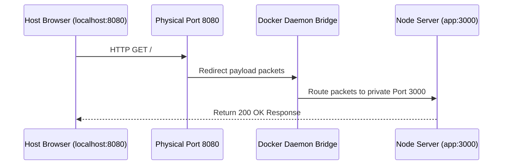

# Week 1 - Day 4: Containerizing Node.js REST API & Port Redirection 🌐

Today, I shifted my focus to **Application Containerization**, setting isolated directory contexts using `WORKDIR`, and opening pathways with `EXPOSE` and port mapping so network traffic can flow between my local host machine and my containers.

---

## 📌 Concepts: WORKDIR, EXPOSE, & Port Redirection

When packaging my application code (like Node.js, Python, or Go APIs) inside a container, managing directories and network accessibility is essential.

### 1. `WORKDIR <path>` (Isolated Context)
* **Purpose:** Sets the active working directory for any subsequent `RUN`, `COPY`, `CMD`, or `ENTRYPOINT` instructions.
* **Why it matters:** It prevents me from polluting base operating system directories (like `/` or `/usr/local`). If the folder path doesn't exist, Docker automatically creates it!

### 2. `EXPOSE <port>` (Metadata Gateway)
* **Purpose:** Declares that my container's standard processes listen on a specific private network port (e.g. `3000`).
* **Why it matters:** It acts strictly as documentation between me and the runtime environment. It does **not** actually open ports on my computer or route host traffic!

### 3. Port Mapping `-p <host_port>:<container_port>`
* **Purpose:** Instructs the Docker daemon to bind a physical port on my computer (the host) and redirect all inbound traffic directly to a private port inside my container's bridge network.



---

## 🛠️ Dockerfile Architecture Review
Here is the production-ready Node.js container blueprint I created:
```dockerfile
# Start from lightweight Node template
FROM node:20-alpine

# Set isolated workspace context
WORKDIR /app

# Copy dependency mappings first to preserve cache layers
COPY package*.json ./
RUN npm install

# Copy source files
COPY . .

# Document active private network listener
EXPOSE 3000

# Launch server process
CMD ["node", "server.js"]
```

---

## 🎯 Day 4 Mini Project: Run and Map hello-api
For my hands-on project, I compiled and executed the Express REST API container.

### Step 1: Compiling the Container Image
I compiled the container image by running:
```bash
docker build -t hello-api ./week-1/day-4/hello-api
```

### Step 2: Running in Detached Mode with Port Mapping
I used the `-d` flag to boot the container in the background (detached mode) and `-p` to map my host port `8080` to the private exposed container port `3000`:
```bash
docker run -d --name node-app -p 8080:3000 hello-api
```

### Step 3: Testing my API Endpoint
I tested that the bridge network successfully mapped incoming traffic by running:
```bash
curl http://localhost:8080
```
*(I received a beautiful diagnostic JSON response showing my CPU architecture, total free memory, and exposed network parameters!)*

### Step 4: Cleaning Up
When finished, I stopped and removed the container:
```bash
docker stop node-app && docker rm node-app
```

---

## 🎨 Interactive Port Visualizer
Open `index.html` inside your browser to view the **Virtual Bridge Router** in action! You can customize host ports, trigger animated request packet pulses, and view simulated console outputs in real-time.
