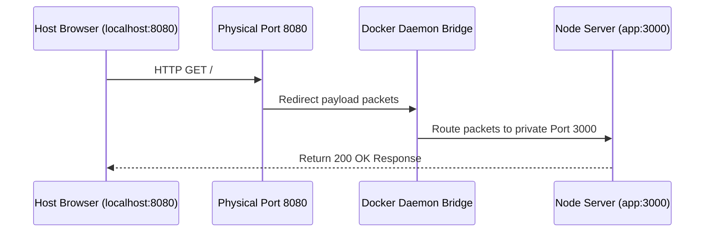

# Week 1 - Day 4: Containerizing Node.js REST API & Port Redirection 🌐

Welcome to Day 4 of your Docker learning journey! Today, we are shifting our focus to **Application Containerization**, setting isolated directory contexts, and opening pathways for network traffic to flow between our local host machine and the container.

---

## 📌 Concepts: WORKDIR, EXPOSE, & Port Redirection

When packaging application code (like Node.js, Python, or Go APIs) inside a container, managing directories and network accessibility is essential.

### 1. `WORKDIR <path>` (Isolated Context)
* **Purpose:** Sets the active working directory for any subsequent `RUN`, `COPY`, `CMD`, or `ENTRYPOINT` instructions.
* **Why it matters:** It prevents polluting base operating system directories (like `/` or `/usr/local`). If the folder path doesn't exist, Docker automatically creates it!

### 2. `EXPOSE <port>` (Metadata Gateway)
* **Purpose:** Declares that the container's standard processes listen on a specific private network port (e.g. `3000`).
* **Why it matters:** It acts strictly as documentation between the image builder and operator. It does **not** actually open ports on your computer or route host traffic!

### 3. Port Mapping `-p <host_port>:<container_port>`
* **Purpose:** Instructs the Docker daemon to bind a physical port on your computer (the host) and redirect all inbound traffic directly to a private port inside the container's bridge network.



---

## 🛠️ Dockerfile Architecture Review
Here is the production-ready Node.js container blueprint we built for today:
```dockerfile
# Start from lightweight Node template
FROM node:20-alpine

# Set isolated workspace context
WORKDIR /app

# Copy dependency mappings first to preserve cache layers
COPY package*.json ./
RUN npm install

# Copy source files
COPY . .

# Document active private network listener
EXPOSE 3000

# Launch server process
CMD ["node", "server.js"]
```

---

## 🎯 Day 4 Mini Project: Run and Map hello-api
Let's build and execute the Express REST API container.

### Step 1: Compile the Container Image
Execute this command inside the project directory:
```bash
docker build -t hello-api ./week-1/day-4/hello-api
```

### Step 2: Run in Detached Mode with Port Mapping
We use the `-d` flag to boot the container in the background (detached mode) and `-p` to map host port `8080` to private exposed container port `3000`:
```bash
docker run -d --name node-app -p 8080:3000 hello-api
```

### Step 3: Test and Curl the API
Check if the bridge network successfully maps incoming traffic:
```bash
curl http://localhost:8080
```
*(You will receive a beautiful diagnostic JSON response showing CPU architecture, total free memory, and exposed network parameters!)*

### Step 4: Cleanup
```bash
docker stop node-app && docker rm node-app
```

---

## 🎨 Interactive Port Visualizer
Open `index.html` inside your browser to view the **Virtual Bridge Router** in action! You can customize host ports, trigger animated request packet pulses, and view simulated console outputs in real-time.
