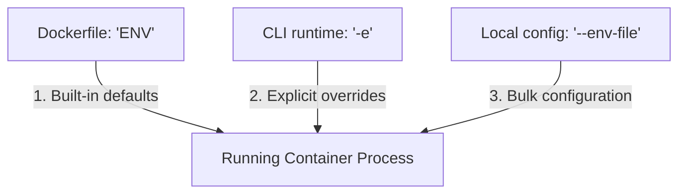

# Week 1 - Day 6: Environment Variables & Secrets Configuration 🌍

Today, I mastered **Environment Variables** in Docker. I learned how to inject dynamic configurations, database hosts, and server ports into running containers without editing the source code or rebuilding the image. I also explored security patterns to secure API keys and other credentials using `.env` configurations.

---

## 📌 Concepts: Docker Env Injection Channels

Environment variables are simple key-value pairs (like `PORT=3000`) loaded into the container's execution shell context. Docker offers three distinct channels to inject these:



### 1. The `ENV` Dockerfile Instruction
* **Purpose:** Sets persistent environment variables inside the compiled image filesystem.
* **Why it matters:** Perfect for setting robust default variables (like `PORT=3000` or `NODE_ENV=production`). Any container booted from this image will inherit these defaults.

### 2. The Runtime command `-e` or `--env`
* **Purpose:** Explicitly injects or overrides variables in the shell command when starting a container.
* **Why it matters:** Perfect for quick runtime adjustments.
* **Example:** `docker run -e WELCOME_MESSAGE="Hello from production!" -d my-app`

### 3. Bulk Injection via `--env-file`
* **Purpose:** Instructs the Docker daemon to parse a local `.env` text file and inject all its declarations into the container context.
* **Why it matters:** Keeps secret tokens (like API keys, DB passwords) fully separated from your codebase. It ensures secret keys are never committed to Git!

---

## ⚙️ Security Best Practices: ARG vs ENV

| Parameter | When to use | Git Safety | Survives in Container? |
| :--- | :--- | :--- | :--- |
| **`ARG`** (Build-time variables) | Passing compilation parameters (e.g. `npm install` packages version). | **Unsafe** (Recorded in image history!). | **No** (Discarded once compiled). |
| **`ENV`** (Runtime variables) | Standard defaults and configs. | **Unsafe for secrets** (Plaintext defaults visible in Dockerfile!). | **Yes** (Lives in container memory). |
| **`.env`** (Runtime injection file) | **Database credentials, private API keys, secrets.** | **Safe** (Stored locally, ignored by Git). | **Yes** (Injected securely at boot). |

---

## 🎯 Day 6 Mini Project: env-playground REST API

For my hands-on project, I containerized a dynamic Node Express server (`env-playground`) that parses `process.env` configurations. I built a custom Dockerfile with robust built-in defaults and simulated loading environment configurations using a local `.env` file.

### Step 1: Copy the Template Configuration
I copied the provided template config file to create my private variables:
```bash
cp ./week-1/day-6/env-playground/.env.example ./week-1/day-6/env-playground/.env
```
*(My local `.env` is fully protected because we added `node_modules` and `.env` in my root `.gitignore`!)*

### Step 2: Build the Dynamic Container Image
I compiled the playground image:
```bash
docker build -t env-playground ./week-1/day-6/env-playground
```

### Step 3: Boot with Custom Environment File
I booted my container in the background, mounting the `.env` configuration file directly to initialize its runtime variables:
```bash
docker run -d --name env-app --env-file ./week-1/day-6/env-playground/.env -p 8080:3000 env-playground
```

### Step 4: Validate Configuration Telemetry
I queried my server API endpoint to verify if the server dynamically styled itself according to my `.env` specifications:
```bash
curl http://localhost:8080
```
*(Boom! The JSON response returned displaying my database host 'pg-db-host', green color theme `#10b981`, and a custom greeting message. I successfully updated the application parameters without rebuilding!)*

### Step 5: Clean Up
```bash
docker stop env-app && docker rm env-app
```

---

## 🎨 Interactive Configurations Sandbox
Open **`index.html`** in your browser to play inside the **Environment Variables Engine** dashboard! You can customize key-values, boot containers, view terminal logs, and watch the container skin change dynamically!
