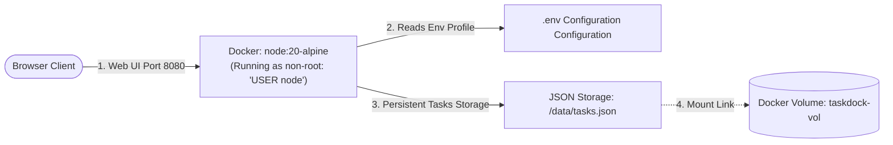

# Week 1 - Day 7: Full-Stack Capstone Project (TaskDock Portal) 📋🛡️

Today, I finalized my first week of Docker by building my graduation capstone project: **TaskDock Portal**! I consolidated everything I learned about multi-stage builds, Alpine distros, port configurations, named volumes, non-root system users, and environment variables into a production-grade, secure multi-service application.

---

## 🏗️ Architectural Topology

The TaskDock workspace bridges container execution structures directly with host directory structures, enabling real-time persistence and diagnostic logs telemetry:



---

## 🛡️ Hardened Production Patterns: Why this is Secure

Instead of deploying a basic application, I implemented professional industry standards to secure my container in production:

1. **Multi-Stage Build Pipeline:** 
   * **Stage 1 (Builder):** Uses full `node:20-alpine` environment to pull down and compile Node modules safely.
   * **Stage 2 (Runtime):** Copies *only* the production assets and clean dependencies into a fresh, barebones image, saving storage and shrinking the attack surface area!
2. **Non-Root Execution Privilege (`USER node`):**
   * By default, Docker containers run commands as `root`. If a hacker compromises an app, they instantly gain administrative access to the host machine!
   * I resolved this by configuring the standard `USER node` shell inside the Dockerfile, stripping away administrative privileges from the running backend process.
3. **Write-Protected Volumetric Persistence:**
   * Crucial task data is isolated to `/data/tasks.json` and linked to an independent named volume `taskdock-vol`. If the container process is terminated or breached, the volume preserves data integrity while preventing write access to other host filesystems.

---

## 🚀 Orchestration Guide & Steps

I created an automated colorized script `run-project.sh` to handle the entire builder lifecycle. Here are the manual steps I verified:

### Step 1: Copy Local Environmental Secrets
I established my environmental variables by copying the blueprint configuration:
```bash
cp ./week-1/day-7/taskdock/.env.example ./week-1/day-7/taskdock/.env
```

### Step 2: Initialize Docker Named Volume
I allocated a persistent virtual storage block for my task board database:
```bash
docker volume create taskdock-vol
```

### Step 3: Build the Optimized Multi-Stage Image
I compiled the image using Docker's build caching layer:
```bash
docker build -t taskdock ./week-1/day-7/taskdock
```

### Step 4: Launch the Secure Container Daemon
I spun up the container, routing port `8080` to inside port `3000` while linking my configuration secrets and persistent storage volume:
```bash
docker run -d \
  --name taskdock-app \
  --env-file ./week-1/day-7/taskdock/.env \
  -v taskdock-vol:/data \
  -p 8080:3000 \
  taskdock
```

### Step 5: Test Persistence & Disaster Recovery
1. Go to **`http://localhost:8080`** in your browser.
2. Create three core task boards (e.g. *"Review bridge ports"*, *"Optimize dockerignore"*).
3. Open a terminal and forcefully destroy the container process:
   ```bash
   docker rm -f taskdock-app
   ```
4. Re-launch a brand-new container instance linked to the exact same named volume:
   ```bash
   docker run -d --name taskdock-app --env-file ./week-1/day-7/taskdock/.env -v taskdock-vol:/data -p 8080:3000 taskdock
   ```
5. Refresh your browser page. **Boom!** Your developer tasks are still there, fully intact! Persistence is fully validated.
