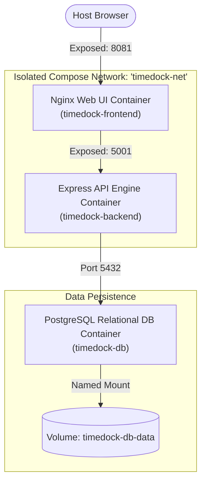

# Week 2 - Day 10: Advanced Multi-Container Compose Integration ⏱️🐋

For Day 10, I designed and deployed **TimeDock**, a premium three-tier productivity tracker orchestrating Nginx static servers, Node Express backends, and PostgreSQL databases completely inside Docker Compose networks! 

This project expands on Day 9 concepts by introducing **dynamic relational inserts, duration calculation formulas, active states (tracking vs stopped), and modular subdirectories**.

---

## 🏗️ Relational Productivity Architecture



---

## ⚙️ Key Technical Features Inside TimeDock

1. **Relational PostgreSQL Operations:**
   * Moves beyond simple JSON dumps. Backend queries execute advanced `INSERT`, `UPDATE`, and dynamic duration computations (`start_time` vs `end_time`).
2. **Resilient Port Mapping & Multi-Compose Isolation:**
   * Uses customized host ports (`8081` for Nginx, `5001` for Node Express) to prevent network socket conflicts with active Day 9 Compose instances!
3. **Advanced Connection Retries:**
   * Injects an elegant reconnection algorithm that safely retries DB connection loops, protecting the app from race-condition database restarts.

---

## 🚀 Unified Compose Commands Reference

```bash
# 1. Spin up the entire multi-tier workspace
docker compose -f ./week-2/day-10/timedock/docker-compose.yml up -d --build

# 2. Monitor stdout logs in real-time
docker compose -f ./week-2/day-10/timedock/docker-compose.yml logs -f

# 3. Clean up the sandbox safely (persisting your data!)
docker compose -f ./week-2/day-10/timedock/docker-compose.yml down
```
*(All time logs, projects, and productivity counters remain safely preserved inside the persistent named volume `timedock-db-data` across cycles!)*
