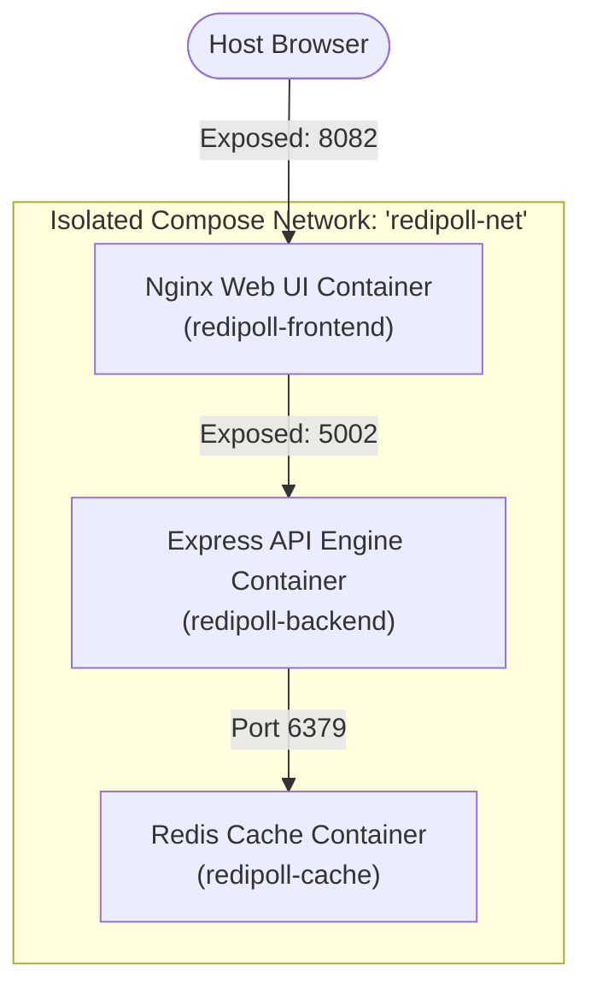

# Week 2 - Day 11: High-Speed Caching Layer with Redis ⚡📦

Today, I explored the integration of a **high-speed caching and key-value store (Redis)** into my multi-container Docker Compose microservices! I built **RediPoll**, an interactive, real-time developer opinion polling dashboard backed by a containerized Redis instance.

This project reinforces how lightweight Redis caching containers can be launched securely alongside our Express backend APIs, linked automatically over Compose virtual bridge subnet layers.

---

## 🏗️ RediPoll Microservices Topology



---

## ⚙️ Redis Caching Layer Configurations

* **Internal Port Security:**
  * Redis listens on port `6379`. Inside the Compose network `redipoll-net`, the database is completely unexposed to the host, protecting the socket memory layer from external internet access.
* **Auto-Discovery DNS Hostnames:**
  * The backend resolves the cached link using the domain `redipoll-cache:6379` automatically provided by Compose DNS resolution.
* **Non-Persistent Caching Best Practice:**
  * Redis is configured as an ephemeral, high-speed RAM voting registry. Perfect for real-time polling data that updates instantly with zero disk write delays!

---

## 🚀 United Compose Commands Reference

```bash
# 1. Spin up the entire multi-tier workspace
docker compose -f ./week-2/day-11/redipoll/docker-compose.yml up -d --build

# 2. Monitor stdout logs in real-time
docker compose -f ./week-2/day-11/redipoll/docker-compose.yml logs -f

# 3. Clean up the sandbox safely
docker compose -f ./week-2/day-11/redipoll/docker-compose.yml down
```
*(Boom! The entire stack initializes in seconds, presenting a clean polling playground served dynamically on host port 8082!)*
