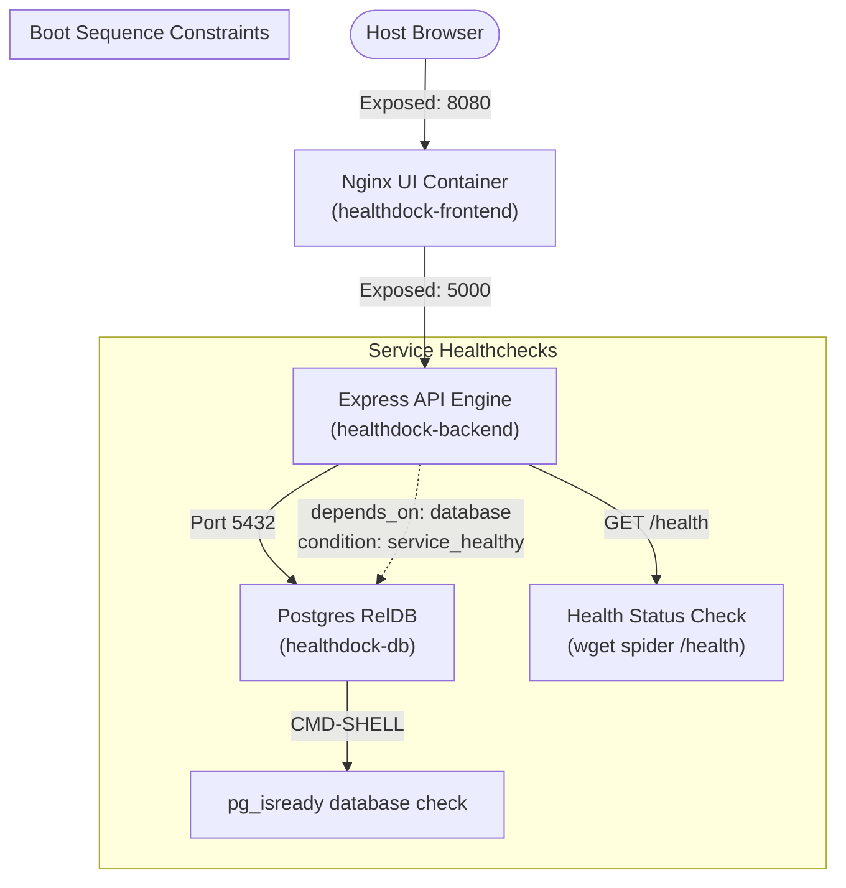

# Week 2 - Day 12: Declarative Container Healthchecks & Self-Healing 🚀🩺

Today, I mastered Docker **Healthchecks**, a critical production pattern for creating resilient, self-healing microservice clusters! I built **Healthdock**, a dynamic dashboard demonstrating how Docker monitors container health, orchestrates boot sequences using `service_healthy` conditions, and automatically identifies internal failures.

---

## 🏗️ Healthdock Self-Healing Architecture



---

## 🧠 Core Healthcheck Learning Highlights

1. **Active Health Monitoring:**
   * Standard container execution states (like `running`) only mean that the process started, not that it is functional. A **Healthcheck** proactively tests inside the runtime context to verify that port sockets are actually accepting traffic!
2. **`service_healthy` Condition Control:**
   * By using the advanced `depends_on` syntax with conditions:
     ```yaml
     depends_on:
       database:
         condition: service_healthy
     ```
     Our Express backend will pause boot until PostgreSQL responds positively to `pg_isready`. No more boot race conditions or initial connection crashes!
3. **Graceful Failures & Auto-Healing:**
   * If a running container falls unhealthy, external proxies (like Nginx/Ingress) can dynamically stop routing traffic to it, and orchestration engines can restart it automatically.

---

## ⚙️ Stack Orchestration Commands

```bash
# 1. Spin up the self-healing cluster
docker compose -f ./week-2/day-12/healthdock/docker-compose.yml up -d --build

# 2. Inspect active health statuses inside the CLI
docker compose -f ./week-2/day-12/healthdock/docker-compose.yml ps

# 3. Shutdown and clean resources
docker compose -f ./week-2/day-12/healthdock/docker-compose.yml down
```
*(Success! A fully resilient development sandbox, keeping application clusters robust!)*
