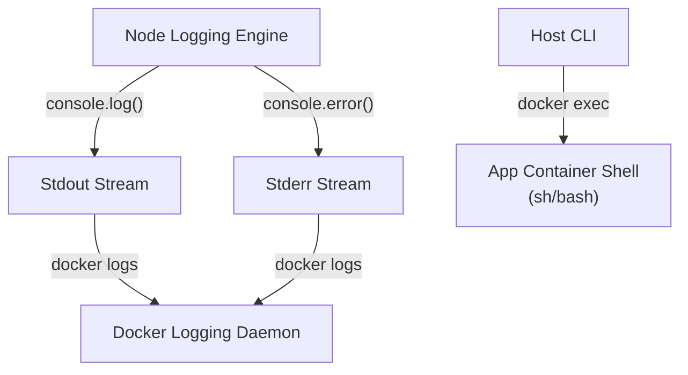

# Week 2 - Day 13: Container Logging & Interactive Command Execution 🩺📜

Today, I explored **Docker Logging Engines** and **Interactive Command Execution**, the two most fundamental tools for debugging, inspecting, and managing running containers! I built **LogDock**, a lightweight logging daemon that demonstrates log routing, stream filtering, and interactive shell execution.

---

## 🏗️ LogDock Diagnostics Architecture



---

## 🧠 Core Logging & Exec Learning Highlights

### 1. The Standard Streams (`stdout` / `stderr`)
* In Docker, any process that writes to **`stdout` (standard output)** or **`stderr` (standard error)** gets automatically intercepted by the Docker daemon's JSON-file logging driver.
* **`console.log()`** maps to `stdout`.
* **`console.error()`** maps to `stderr`.
* Understanding this stream separation lets us filter operational output from critical failures with ease!

### 2. The Power of `docker logs`
* **`-f` (follow):** Stream logs in real-time.
* **`--tail N`:** View only the last `N` lines to avoid loading massive files.
* **`--timestamps` (`-t`):** Prepend accurate timestamps to logs.
* **Filtering errors:**
  ```bash
  # Redirect stdout to /dev/null to view ONLY stderr error logs!
  docker logs logdock-app > /dev/null
  ```

### 3. Debugging with `docker exec`
* **`docker exec`** spins up a new process *inside* an already running container context.
* **`-i` (interactive) & `-t` (tty):** Allows you to allocate a pseudo-terminal and open interactive sessions.
* **Practical commands:**
  ```bash
  # Open an interactive shell inside
  docker exec -it logdock-app sh
  
  # Inspect internal network metrics
  docker exec logdock-app ip addr
  ```

---

## ⚙️ Stack Orchestration Commands

```bash
# 1. Spin up LogDock
docker compose -f ./week-2/day-13/logdock/docker-compose.yml up -d --build

# 2. View and filter logs
docker compose -f ./week-2/day-13/logdock/docker-compose.yml logs -f

# 3. Shutdown
docker compose -f ./week-2/day-13/logdock/docker-compose.yml down
```
*(Success! Clear logging architectures for robust containers!)*
