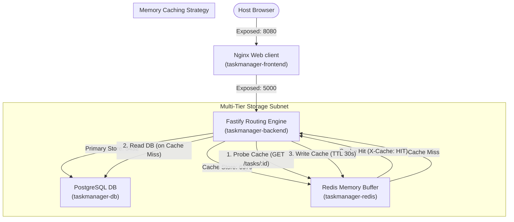

# Week 2 - Day 14: Ultra-Fast Microservices with Fastify, Postgres, & Redis 🚀⚡

Today, I built **Task Manager**, an enterprise-grade high-performance web microservices stack! It showcases **Fastify** as the super-speedy backend router, **PostgreSQL** as the reliable relational storage engine, **Redis** as the ephemeral caching/speed layer, and **Docker Compose** to coordinate the isolated networking bridge subnets.

---

## 🏗️ Task Manager High-Performance Architecture



---

## 🧠 High-Speed Tech Stack Integrations

1. **Why Fastify?**
   * Express is awesome, but **Fastify** is engineered for absolute efficiency, handling up to 30,000+ requests/sec with minimal overhead. It features robust built-in JSON schema parsing and a lightweight plug-in architecture.
2. **Dynamic Redis Write-Through Caching:**
   * **Cache Read (HIT):** When querying an individual task by ID, Fastify queries Redis first. If present, it skips PostgreSQL entirely (X-Cache: HIT), delivering sub-millisecond response rates!
   * **Cache Miss:** If absent, it queries PostgreSQL, populates the Redis cache key with a 30-second TTL (Time to Live), and serves the request (X-Cache: MISS).
   * **Cache Purge:** When a task is created, updated, or deleted, the active cache registry key is purged to ensure optimal data consistency.

---

## ⚙️ Stack Orchestration Commands

```bash
# 1. Spin up the cluster
docker compose -f ./week-2/day-14/task-manager/docker-compose.yml up -d --build

# 2. Inspect running cluster nodes
docker compose -f ./week-2/day-14/task-manager/docker-compose.yml ps

# 3. Shutdown
docker compose -f ./week-2/day-14/task-manager/docker-compose.yml down
```
*(Success! A premium high-performance Docker Compose orchestration sandbox!)*
