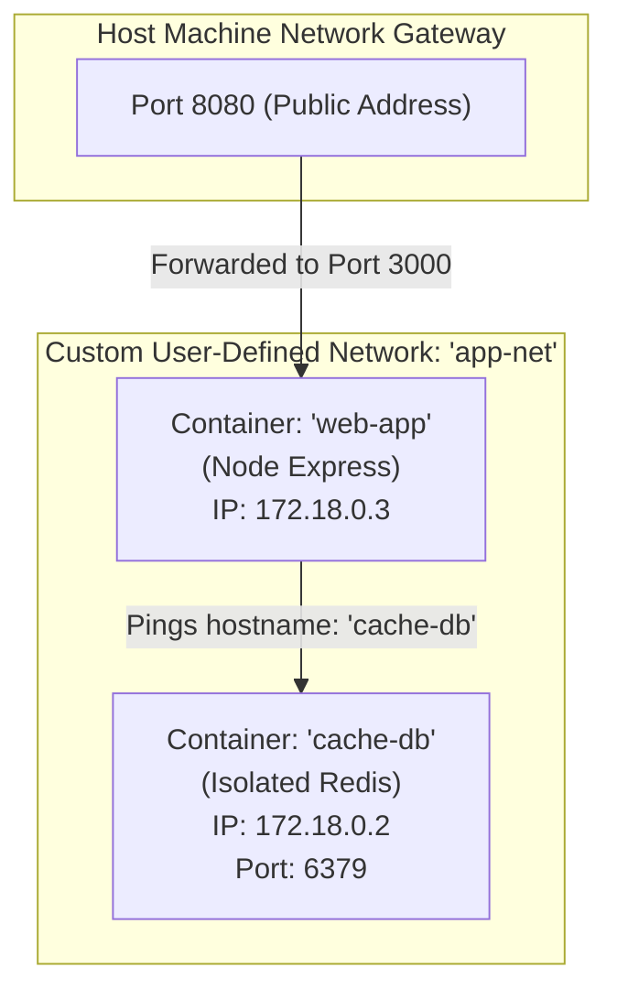

# Week 2 - Day 8: User-Defined Docker Bridge Networks 🌐🔌

Today, I kicked off **Week 2: Multi-Container Environments**! I graduated from running isolated single-container applications to orchestrating a real-world multi-container web environment. I learned how to create a **User-Defined Bridge Network** to connect a Node Express API server dynamically to an isolated Redis caching database using Docker's built-in **DNS Service Discovery** instead of brittle, hardcoded IP addresses.

---

## 🌐 The Concepts: Default vs. User-Defined Bridge Networks

Docker provides network drivers to manage how containers talk to the host, each other, and external services. The standard driver for local multi-container environments is the **Bridge Network**.



### 1. The Default Bridge Network (`bridge`)
* **What it is:** The default network every container joins if you don't specify one.
* **The major flaw:** It **does not support automatic service discovery** (DNS resolution). If `web-app` wants to talk to `cache-db`, you must manually parse and hardcode the container's private IP (like `172.17.0.2`). If the database container reboots, its IP changes, breaking the entire application!
* **Security risk:** All default containers can talk to each other, resulting in zero network isolation.

### 2. User-Defined Bridge Networks (Recommended)
* **What it is:** A private, custom virtual bridge network created using `docker network create`.
* **Automatic Service Discovery (DNS):** Docker runs an internal DNS server. Containers can ping each other directly by their **Container Name** (acting as a domain hostname)! If `web-app` queries `cache-db:6379`, the DNS server automatically translates it to the active IP.
* **Harden Security & Isolation:** Containers on this network are inaccessible to other default containers on the host, preventing external access to internal data stores (like Redis ports).

---

## 🎯 Day 8 Capstone: Multi-Container visits-counter App

For my project, I built a multi-container stack combining a Node Express API (`web-app`) with an isolated Redis caching instance (`cache-db`) connected via a user-defined network `app-net`.

### Step 1: Initialize the Private Bridge Network
I created my custom network layer:
```bash
docker network create app-net
```

### Step 2: Boot the Isolated Redis Database
I launched Redis inside the private network. Notice I **did not expose any ports to the host** (`-p 6379:6379` is completely absent!). This locks the database inside the network, fully protecting it from external host hackers:
```bash
docker run -d --name cache-db --network app-net redis:7-alpine
```

### Step 3: Compile and Launch the Express Web App
I compiled my Node backend:
```bash
docker build -t network-playground ./week-2/day-8/network-playground
```
Then I launched it on the same network, exposing its port `8080` to the host:
```bash
docker run -d \
  --name web-app \
  --network app-net \
  -e REDIS_HOST=cache-db \
  -p 8080:3000 \
  network-playground
```

### Step 4: Validate DNS Resolution and Network Hits
I sent curl queries to confirm Docker's DNS mapped the service hosts correctly:
```bash
# 1. Test hit counter (Redis registers and increments visit logs!)
curl http://localhost:8080/api/visits

# 2. Test DNS resolution status
curl http://localhost:8080/api/network-status
```
*(Awesome! The DNS diagnostics response returns showing optimal status and proves that 'cache-db' resolved automatically to the internal IP `172.18.0.2` via Docker DNS!)*

### Step 5: Test Network Disconnection (Isolation)
I detached the database dynamically to verify isolation:
```bash
docker network disconnect app-net cache-db
```
*(Querying the visits endpoint now shows a degraded status, falling back to local memory storage because the database was dynamically isolated from the network!)*

### Step 6: Clean Up
```bash
docker stop web-app cache-db && docker rm web-app cache-db && docker network rm app-net
```

---

## 🎨 Interactive Networks Dashboard
Open **`index.html`** in your browser to play inside the **Bridge Networks Dashboard**! Connect/disconnect nodes, send request packets, and watch the automatic DNS routing in real-time!
