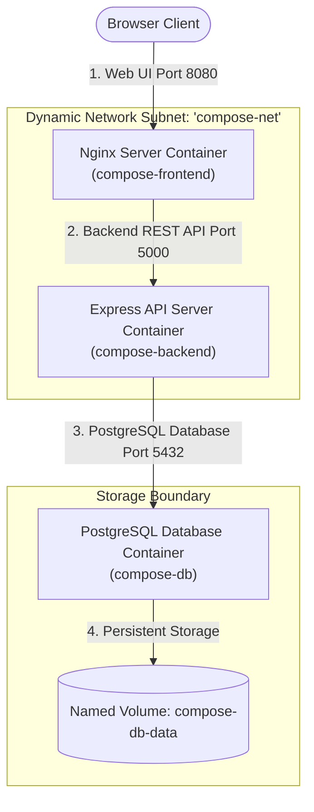

# Week 2 - Day 9: Multi-Container Orchestration with Docker Compose 🎛️🐋

Today, I took a massive leap in my containerization journey: I graduated from manual container bridging to writing declarative, production-ready blueprints using **Docker Compose**! Instead of writing complex, multi-line shell orchestration scripts to create networks, volumes, and launch individual containers in sequence, I consolidated a three-tier full-stack application (Nginx Frontend, Node/Express Backend, and PostgreSQL Database) into a single, clean **YAML config file (`docker-compose.yml`)**.

---

## 🏗️ The Multi-Service Topology

Docker Compose simplifies multi-container lifecycle management. Here is the topology of the full-stack system I orchestrated today:



---

## ⚙️ Understanding the YAML Configuration Specs

A declarative `docker-compose.yml` file acts as the single source of truth for the entire application stack. Here are the core configuration blocks I implemented today:

1. **`services:`**
   * This is where each independent node/container is declared. Today, I defined `frontend`, `backend`, and `database` nodes.
2. **`build:`**
   * Tells Compose where to find the custom `Dockerfile` context. Compose will automatically compile, optimize, and build the custom container images on the fly!
3. **`depends_on:` (Orchestration Order)**
   * **Crucial for stability.** Tells Compose to build and start dependent services first. Today, I instructed the `backend` to wait for the `database` to be online, and the `frontend` to wait for the `backend`. This guarantees that services never crash due to database connection lags on boot!
4. **`volumes:`**
   * Allocates virtual disk blocks. Linking `compose-db-data` to `/var/lib/postgresql/data` guarantees that our database entries survive across dynamic stack crashes.
5. **`networks:`**
   * Configures a private virtual bridge. Compose creates the network automatically, granting each service an internal DNS hostname (e.g., the backend connects to `postgres://compose-db:5432`).

---

## 🚀 Orchestration Guide & Power Commands

Today, I verified that managing a complex three-tier stack is reduced to simple, unified commands:

### Step 1: Spin Up the entire Stack in background Daemon Mode
```bash
docker compose -f ./week-2/day-9/composedock/docker-compose.yml up -d --build
```
*(Boom! Compose compiles the multi-stage Nginx and Node Dockerfiles, allocates the private network bridge and named volume, and launches all three containers in perfect sequence!)*

### Step 2: Unified Container Telemetry check
```bash
docker compose -f ./week-2/day-9/composedock/docker-compose.yml ps
```
*(Instantly prints a clean dashboard of all three active containers, their private IPs, port mappings, and running states.)*

### Step 3: CombinedStdout Console Streams
```bash
docker compose -f ./week-2/day-9/composedock/docker-compose.yml logs -f
```
*(Queries and aggregates stdout logs from all three containers into a single terminal window with colored prefixes for frontend, backend, and db. Excellent for real-time debugging!)*

### Step 4: Gracefully Power Down & Clean Up
```bash
docker compose -f ./week-2/day-9/composedock/docker-compose.yml down
```
*(Terminates all running containers and isolates custom networks. Because we mapped a persistent Named Volume, all PostgreSQL database records remain safely preserved for the next boot!)*
