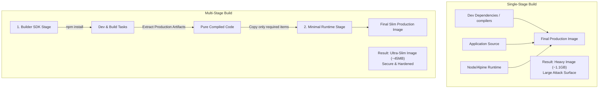

# Week 3 - Day 15: Deep-Dive into Advanced Multi-Stage Builds 🚀📦

Welcome to **Week 3: Production Thinking**! The goal of this week is to prepare our containerized applications to live **beyond localhost** in secure, robust, and highly-optimized cloud environments. 

Today, I explored **Advanced Multi-Stage Builds**, the industry standard for optimizing Docker image footprints, securing production runtimes, and speeding up CI/CD pipelines!

---

## 🏗️ Single-Stage vs. Multi-Stage Lifecycles



---

## 🧠 Core Production Caching & Size Optimization Highlights

### 1. The Multi-Stage Paradigm
* **Separation of Concerns:** We use a full-featured heavyweight SDK container to build/compile our assets (e.g., TypeScript compilation, Webpack bundlers, C++ native modules) and then copy *only* the final compiled output into a highly-stripped, minimal runtime container.
* **Security Hardening:** Production environments do not need compilers, test suites, or sensitive credentials used at build-time. By discarding them in the builder stage, we minimize the container's security attack surface!

### 2. Comparative Image Size Metrics

| Strategy | Base Image | Build Tools Included? | Production Size | Attack Surface |
| :--- | :--- | :--- | :--- | :--- |
| **Traditional Single-Stage** | `node:20` | Yes (npm, git, compilers) | **~1.1 GB** | High |
| **Optimized Single-Stage** | `node:20-alpine` | Yes (npm, apk) | **~180 MB** | Medium |
| **Advanced Multi-Stage** | `node:20-alpine` | **No** (Only node engine) | **~50 MB** | **Extremely Low** |

---

## ⚙️ How to Build targeted Stages

Using `--target`, we can build intermediate stages for local development or testing without executing the final production steps:

```bash
# Build ONLY the development environment target
docker build --target development -t stagedock:dev .

# Build the final production ready image
docker build -t stagedock:prod .
```
*(Success! Advanced multi-stage compilation for ultra-slim, secure production images!)*
