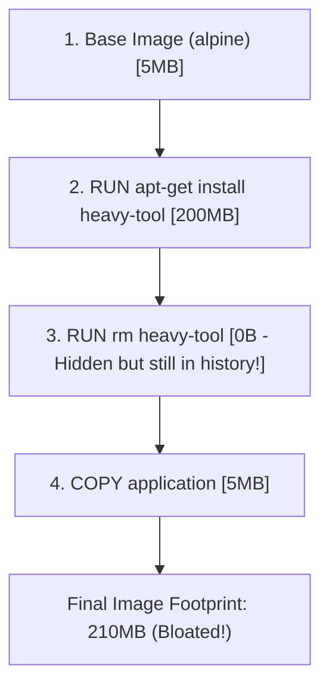

# Week 3 - Day 16: Docker Image Size Optimization & Layer Interrogation 🩺🔍

Today, we dive deep into **Docker Layer Optimization**. Understanding how Docker caches, appends, and manages layers is crucial to creating lightweight, production-grade container footprints!

---

## 🧠 The Mechanics of Docker Layers (Union File System)

Docker images are structured as a read-only stack of layers. Each instruction in a `Dockerfile` (e.g., `RUN`, `COPY`, `ADD`) creates a new layer:



### The "Hidden File" Gotcha:
* **The Problem:** If you download a heavy asset (like a tarball or zip file), extract it, and then delete the zip in a *separate* `RUN` statement, **the zip file is still stored in the previous layer's history!**
* **The Solution:** We must download, extract, and clean up all in **one single chained `RUN` instruction** (using `&&` and `rm`).

---

## 🛠️ Essential Optimization Tools & Commands

To inspect, audit, and analyze image layers, we use two fundamental commands:

### 1. `docker image ls`
Lists all images in the local host database alongside their tag allocations and virtual footprints.
```bash
docker image ls | grep sizedock
```

### 2. `docker history`
Traces the origin of every layer inside an image, detailing the command that created it, the timestamp, and the exact physical byte cost!
```bash
docker history sizedock:unoptimized
```
*(Success! Custom sandboxes built to interrogate layer costs and chain compilation scripts!)*
