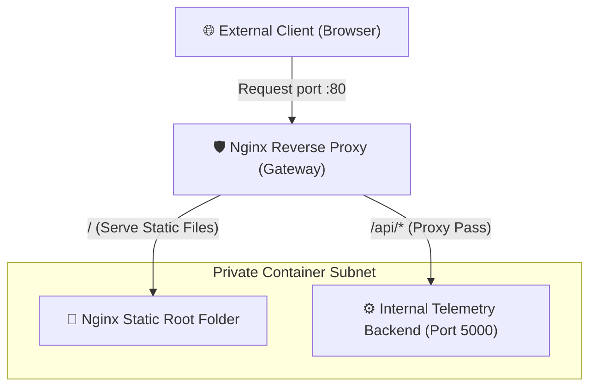

# Week 3 - Day 17: Production Gateway & Nginx Reverse Proxying 🌐🛡️

Welcome to **Day 17** of our production journey! Today, I built and automated **ProxyDock**, a multi-service container orchestration system implementing a production-grade **Nginx Reverse Proxy & Unified Gateway**.

---

## 🏗️ Reverse Proxy Architecture Design

In production, we never expose multiple raw internal application ports (like `8080` for Nginx frontend and `5000` for Fastify backend) to the internet. Instead, we place a single gateway (Nginx) in front of them:



---

## 🧠 Strategic Production Benefits

### 1. Eliminating Cross-Origin Resource Sharing (CORS) Bloat
* **The Problem:** In development, when your frontend runs on `http://localhost:8080` and queries `http://localhost:5000`, the browser blocks it due to Same-Origin policies, forcing developers to configure loose CORS permissions.
* **The Solution:** With Nginx, both the frontend assets and the API live on the **same port and host** (e.g., `/` for client, `/api` for backend). The browser sees a single unified origin, **completely eliminating CORS vulnerabilities!**

### 2. Header Layer Hardening
Nginx rewrites requests dynamically to ensure internal backend processes receive accurate metadata about clients:
* `Proxy-Set-Header Host $host`: Forwards the original host header requested by the client.
* `X-Real-IP $remote_addr`: Forwards the actual client network IP addresses instead of the proxy container IP.
* `X-Forwarded-For $proxy_add_x_forwarded_for`: Builds a chain tracing every proxy hop a request traverses.

---

## ⚙️ Core Configuration Directives

```nginx
# Declarative proxy routing in nginx default.conf
location /api/ {
    proxy_pass http://backend:5000/api/;
    proxy_set_header Host $host;
    proxy_set_header X-Real-IP $remote_addr;
    proxy_set_header X-Forwarded-For $proxy_add_x_forwarded_for;
}
```
*(Success! Custom Nginx proxy engines compiled and deployed securely!)*
