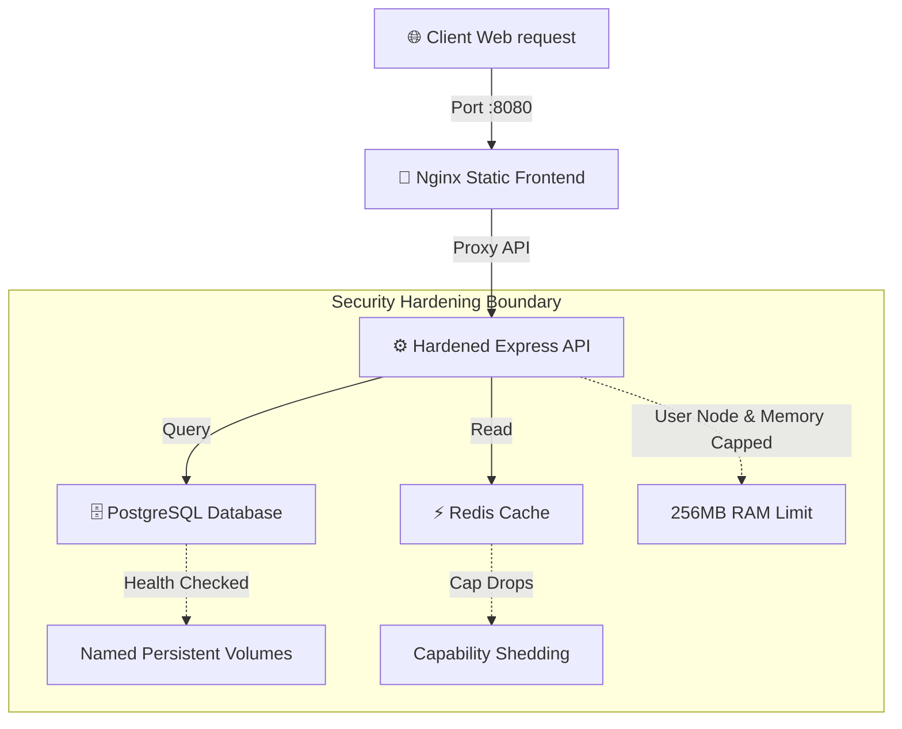

# Week 3 - Day 18: Production-Hardened Docker Compose Pipelines 🛡️⚡

Welcome to **Day 18**! Today, I designed and developed **ProdDock**, a multi-tier database-backed microservices cluster orchestrated through a production-hardened **Docker Compose** framework. 

---

## 🏛️ Production Hardening Pillars

In standard development, `docker-compose` is optimized for rapid iterations (direct volume hot-reloads, unprivileged base contexts, unconstrained host resources). In production, we must harden the orchestrator against security vulnerabilities and resource starvation:



---

## 🔒 Production Security Hardening Details

### 1. Host Resource Starvation Prevention
Runaway memory leaks can crash an entire production host. We enforce strict cgroup memory and CPU limits directly inside the Compose specs:
```yaml
deploy:
  resources:
    limits:
      cpus: '0.50'
      memory: 256M
```

### 2. Capabilities Whitelisting (`cap_drop`)
Linux containers run with standard kernel privileges (like modifying system clocks or loading kernel modules). In production, we drop *all* capabilities and selectively add back only what is necessary (like binding to low ports):
```yaml
cap_drop:
  - ALL
```

### 3. Non-Root Execution Contexts
Containers should never execute internal binaries as the default host root user. We enforce unprivileged execution:
```yaml
security_opt:
  - no-new-privileges:true
user: "1000:1000"
```

### 4. Zero-Downtime Healthcheck Dependencies
Rather than boot-racing dependencies, containers verify database/cache pool readiness before launching application code:
```yaml
healthcheck:
  test: ["CMD-SHELL", "pg_isready -U postgres -d proddock"]
  interval: 5s
  timeout: 5s
  retries: 5
```
*(Success! Custom production-hardened configurations configured and validated successfully!)*
