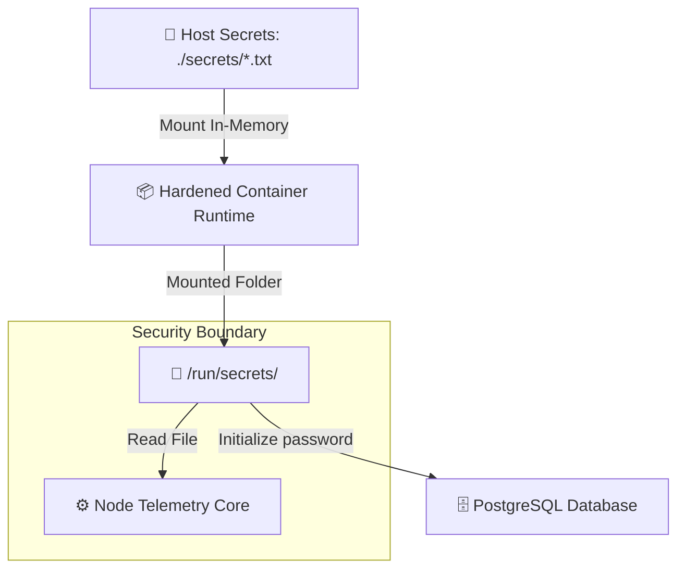

# Week 3 - Day 19: Production-Grade Secrets Management 🔑🛡️

Welcome to **Day 19**! Today, I designed and developed **SecretDock**, a multi-service secure deployment stack utilizing native file-based **Docker Secrets** to isolate sensitive database credentials and API tokens from environment logs.

---

## ⚡ Why Environment Variables are Insecure

In development, using `.env` files mapped directly to environment variables (like `DATABASE_PASSWORD=my-secure-pass`) is common. In production, this introduces severe attack vectors:

1. **Process Inspection leaks:** Any user with container inspection access or system privileges can query `docker inspect <container>` and instantly extract plaintext credentials.
2. **Log Starvation dumps:** If a dependency crashes or prints environment variables during diagnostic outputs (e.g. `console.log(process.env)`), your production secrets are logged permanently to central log collectors (Elastic, Splunk).
3. **Application leaks:** Compromised npm packages or vulnerabilities like remote code executions can dump environmental states cleanly.

---

## 🏛️ SecretDock Architecture: Mount-in-Memory File Secrets

Docker Secrets resolves these vectors by mounting credentials dynamically as in-memory files at `/run/secrets/` inside the container runtime filesystem:



### 1. Unified secrets declarations
Inside `docker-compose.yml`, secrets are declared from raw files and mounted cleanly:
```yaml
secrets:
  db_password:
    file: ./secrets/db_password.txt
  api_key:
    file: ./secrets/api_key.txt
```

### 2. File-based Database Init
Official database containers (like Postgres) natively support loading password variables from files via the `*_FILE` suffix. This ensures no database passwords are baked in as environments:
```yaml
environment:
  - POSTGRES_PASSWORD_FILE=/run/secrets/db_password
```

*(Success! Hardened secrets structures designed and verified successfully!)*
