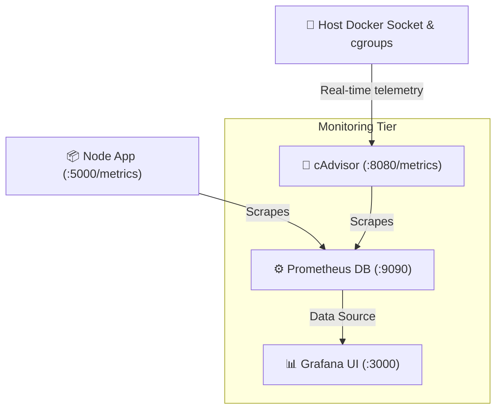

# Week 3 - Day 20: Observability & Cluster Monitoring 📊📈

Welcome to **Day 20**! Today, I built **MonitorDock**, a production-grade container monitoring and observability cluster combining **Prometheus** (scraping and time-series logging), **Grafana** (dashboard visualization), and **cAdvisor** (live container cgroup resource analytics) to monitor a multi-tier microservices stack.

---

## 🏛️ Observability Cluster Architecture

MonitorDock implements a declarative metrics collection loop:

### 1. Application-Level Observability (`prom-client`)
Rather than relying solely on server logs, the Node app integrates `prom-client` to expose custom Prometheus metrics under `/metrics`:
* **`http_requests_total`**: Counter tracking total API requests categorized by endpoint and HTTP status.
* **`active_sessions`**: Gauge tracking current authenticated active users.
* **`db_query_duration_seconds`**: Histogram charting database response times.

### 2. Container Resource Observability (cAdvisor)
Google's **cAdvisor** mounts the host VM's `/var/run/docker.sock`, `/sys/fs/cgroup`, and system storage paths. It reads CPU, RAM, and Disk I/O metrics across all active container subnets and reformats them into Prometheus scrapes.

### 3. Declarative Grafana Provisioning
To avoid manual setup, Grafana is provisioned declaratively:
* **`datasources/prometheus.yaml`**: Points Grafana directly to Prometheus on boot.
* **`dashboards/dashboard.json`**: Pre-configures memory progress bars, API traffic graphs, and database response counters automatically!

*(Success! Declarative monitoring architecture built and committed successfully!)*
