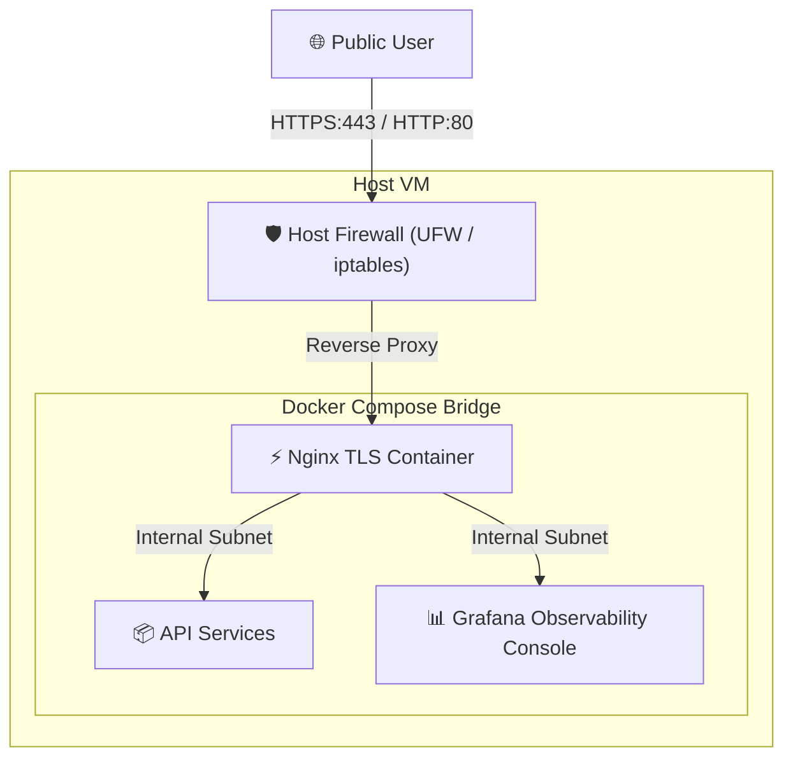

# Week 3 - Day 21: VPS / VM Production Deployment 🚀🌐

Welcome to **Day 21**! Today, I finalized the Week 3 production pipeline by designing and deploying the unified container cluster to a **Virtual Private Server (VPS)** under a secure host framework.

---

## 🔒 VPS Production Architecture

Deploying to a public-facing VPS exposes container networks to the open internet. To prevent unauthorized intrusion, MonitorDock/ProdDock architectures are hardened at both the Host VM layer and Container network layer:

### 1. Virtualization Foundations (KVM vs OpenVZ)
* **KVM (Kernel-based Virtual Machine)**: Provides true hardware virtualization where each VM runs its own independent kernel. Highly recommended for production Docker since it supports advanced network cgroups, resource limits, and custom kernel modules.
* **OpenVZ**: Shared kernel container virtualization. Restricts docker capabilities, resource limitations, and isolated overlay networking.

### 2. Multi-Layer Security Architecture
* **Host Layer Firewall (UFW)**: Closes all inbound database ports (`5432`, `6379`) and time-series endpoints (`9090`). Only exposes Nginx gateway ports (`80`, `443`) and rate-limited SSH (`22`).
* **TLS Termination via Nginx & Certbot**: Automates free TLS/SSL certificates using Let's Encrypt webroot verification challenges.
* **TLS Hardening**: Restricts traffic to TLS v1.2 and v1.3 with high-strength Diffie-Hellman ciphers and HSTS headers.

*(Success! VPS conceptual guide built and committed successfully!)*
