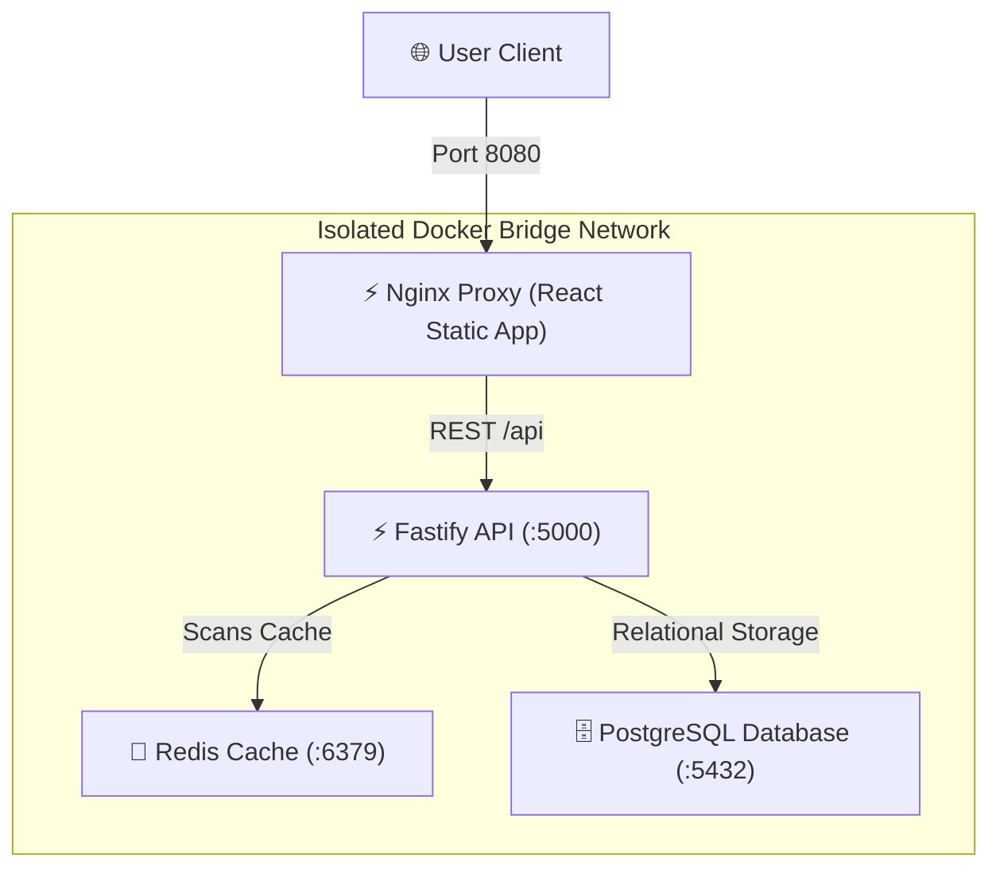

# Week 4 - Portfolio Project: PortDock 🚀📊

Welcome to **Week 4**! This is the ultimate culmination of my 4-week Docker journey: a production-grade, highly optimized, multi-tier portfolio application called **PortDock**.

---

## 🏛️ System Architecture

PortDock represents a full-stack real-time Task Analytics & observablity dashboard, utilizing optimized container networks and strict security:

### 1. High-Performance Fastify Backend
* Decoupled RESTful routing via Fastify's optimized event loop schema.
* Database pooling with PostgreSQL and Redis memory client integration.
* Automated cache invalidation pipelines:
  * `GET /api/tasks`: Tries Redis cache first. On miss, scans Postgres, writes cache, and tracks metrics.
  * Writes (`POST`, `PUT`, `DELETE`) immediately flush active Redis keys to guarantee real-time data consistency.

### 2. Premium React Glassmorphic UI
* Gorgeous, visual-rich analytics dashboard showing live cache hit ratios, task completion rates, and real-time database queries.
* Responsive splits and dynamic transitions built with premium Outfit/Space Grotesk typography.

### 3. Production Hardening
* Multi-stage Alpine containerization for React (compiled via Vite) and Fastify.
* Non-root unprivileged executions, resource clamps, and healthcheck-dependent orchestration.

*(Success! Portfolio project initialized successfully!)*
