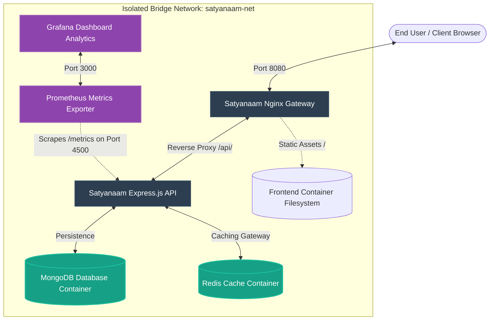

# Satyanaam Food - Production Containerized Architecture Overview

This document provides a technical breakdown of the multi-container production-grade infrastructure orchestrated for the Satyanaam Food platform.

---

## 1. Network Topology & Container Map

The entire infrastructure operates inside an isolated, private user-defined bridge network named `satyanaam-net`.

---

## 2. Infrastructure Node Breakdown

### 2.1 Satyanaam Frontend (Nginx Gateway)
*   **Base Image**: `nginx:1.25-alpine`
*   **Role**: Reverse proxy & Static Web Server. Centralizes HTTP ingress, applies Gzip compression to static assets, routing static site requests on `/` and reverse proxying API traffic requests on `/api/*` to the Express backend container.
*   **Port Mapping**: `8080:80` (public port `8080` bound to internal port `80`).

### 2.2 Satyanaam Backend (Express.js API Server)
*   **Base Image**: `node:18-alpine`
*   **Security Configuration**: Runs under unprivileged, dedicated non-root `node` system user.
*   **Port Mapping**: Internal communication on `4500`. No direct host port exposed to prevent external database query bypasses.
*   **Persistence & Telemetry Integration**:
    *   **Auto-Seed**: On container start, a self-checking menu seeder checks if database is empty and populates it.
    *   **Rate-Limiter**: Intelligently parses `X-Forwarded-For` proxy headers passed from the Nginx proxy to rate limit clients individually.
    *   **Cache Invalidation Hook**: Flushing mechanism that invalidates Redis cache keys whenever admin modification writes are executed.
    *   **Prometheus Metrics Exporter**: Lightweight, built-in telemetry server exposing process uptime, system CPU averages, RAM metrics, and Redis status under `/metrics`.

### 2.3 MongoDB Database
*   **Base Image**: `mongo:6.0`
*   **Volume Mapping**: Mounts persistent docker volume `satyanaam-mongodb-data` to `/data/db`.
*   **Internal Access**: Resolves under container DNS `mongodb:27017`.

### 2.4 Redis Cache
*   **Base Image**: `redis:7.0-alpine`
*   **Persistence**: Configured with strict AOF (Append Only File) persistence and RDB snapshots.
*   **Volume Mapping**: Mounts persistent docker volume `satyanaam-redis-data` to `/data`.
*   **Internal Access**: Resolves under container DNS `redis:6379`.

### 2.5 Prometheus Metrics Scraper
*   **Base Image**: `prom/prometheus:v2.45.0`
*   **Role**: Automatically scrapes `/metrics` endpoint on `satyanaam-backend` every 5 seconds.
*   **Port Mapping**: `9090:9090` (internal and public admin telemetry UI).

### 2.6 Grafana Dashboard Analytics
*   **Base Image**: `grafana/grafana:10.0.3`
*   **Role**: Custom visual analytics tracing real-time system latency, Redis cached key totals, and node memory loads.
*   **Port Mapping**: `3000:3000` (public analytics dashboard).

---

## 3. DevOps Features Summary
1.  **Healthchecks & Graceful Startups**: Mongoose recursive connect-retry routines wait for MongoDB container readiness, preventing premature system crashes.
2.  **Telemetry Ticker**: Frontend displays real-time glowing CSS logs tracing query latency and indicating cache engine origin state (`X-Cache: HIT` vs `X-Cache: MISS`).
3.  **Strict Security Posture**: Non-root system execution, hardened CORS configurations, Nginx security filters, and isolated container networking policies.
