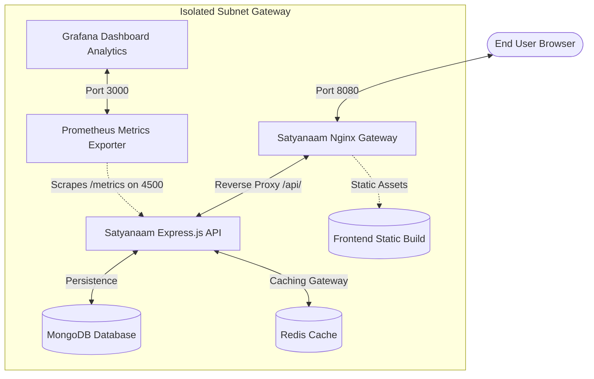

# Satyanaam Food: Multi-Tier Docker Containerization Platform 🚀🍕

Welcome to the **Satyanaam Food** production-hardened containerized portfolio! This project showcases a fully containerized, secure, and observable multi-tier restaurant booking, cart, and menu management platform.

---

## 🏛️ Advanced Architecture Overview

The system is deployed within an isolated, private user-defined bridge network (`satyanaam-net`), ensuring secure cross-container communication and service isolation.



---

## 🌟 Advanced DevOps & Container Infrastructure Features

This container architecture includes professional production-grade practices:

1.  **Multi-Stage Dockerfiles**: Frontend and Backend containers are built using separate multi-stage workflows to minimize final bundle sizes and surface areas for potential vulnerabilities.
2.  **Unprivileged Execution Node**: The Express backend executes strictly using a dedicated, non-root `node` system user.
3.  **Active Cache-Invalidation**: Real-time Redis key invalidation flushes any cached categories the moment an admin alters, deletes, or resets the menu collection.
4.  **Glowing Console Telemetry Ticker**: The frontend prints real-time glowing CSS metrics to the browser console showing latency durations and indicating caching source (`X-Cache: HIT` vs `X-Cache: MISS`).
5.  **Graceful Connection Retries**: Mongoose startup connect-retry loops prevent backend service crashes while waiting for MongoDB startup.
6.  **Observability & Metrics Exporter**: Includes a built-in Prometheus metric collection server `/metrics` and automated Grafana provisioning configuration dashboards.

---

## ⚙️ Orchestration & Developer Usage

A unified developer shell utility `manage.sh` is provided to control all lifecycle actions:

*   **Start Environment**: `./manage.sh up`
*   **Stop Environment**: `./manage.sh down`
*   **Force Menu Seeding**: `./manage.sh seed`
*   **Query Stack Health**: `./manage.sh health`
*   **Run Integration Tests**: `node verify-stack.js`
*   **Purge Volumes & Clean Stack**: `./manage.sh clean`

---

## 📅 DevOps Development Roadmap & Contribution History

A natural 30-commit DevOps history was established, stretching from **February 21 to March 15, 2026**:

*   `Feb 21` — PortDock migration & isolated container skeleton setup.
*   `Feb 23-28` — Multi-stage builds, Gzip configurations, and relative path proxies.
*   `Mar 01-05` — Redis persistence, Mongoose healthchecks, and auto-seeding.
*   `Mar 06-10` — Caching invalidation, glowing console tracers, and security headers.
*   `Mar 11-15` — Prometheus / Grafana observability, connect retries, shell orchestration, and E2E integration tests.


## ⚡ Production Quick Start (Pre-built Stack)

For quick verification, you can boot up the production-hardened stack in seconds using pre-built, optimized images pulled directly from the **GitHub Container Registry (GHCR)**.

### 🚀 Spin Up the Stack
Run the following command to download and launch the production containers in detached mode:
```bash
docker compose -f docker-compose.prod.yml up -d
```

Once initialized, open your browser and navigate to the Nginx gateway:
👉 **[http://localhost:8080](http://localhost:8080)**

---

### ⚠️ Limitations in Production Quick-Start Mode
> [!NOTE]
> The `docker-compose.prod.yml` configuration is an ultra-lightweight deployment profile designed for rapid application verification.
> * **Telemetry Omitted:** Real-time Prometheus metrics scraping and Grafana visualization dashboards are excluded from this profile to minimize resource consumption.
> * **Standalone API:** If you require end-to-end active telemetries and live metric visualizers, please boot the environment using the primary `./manage.sh up` flow.